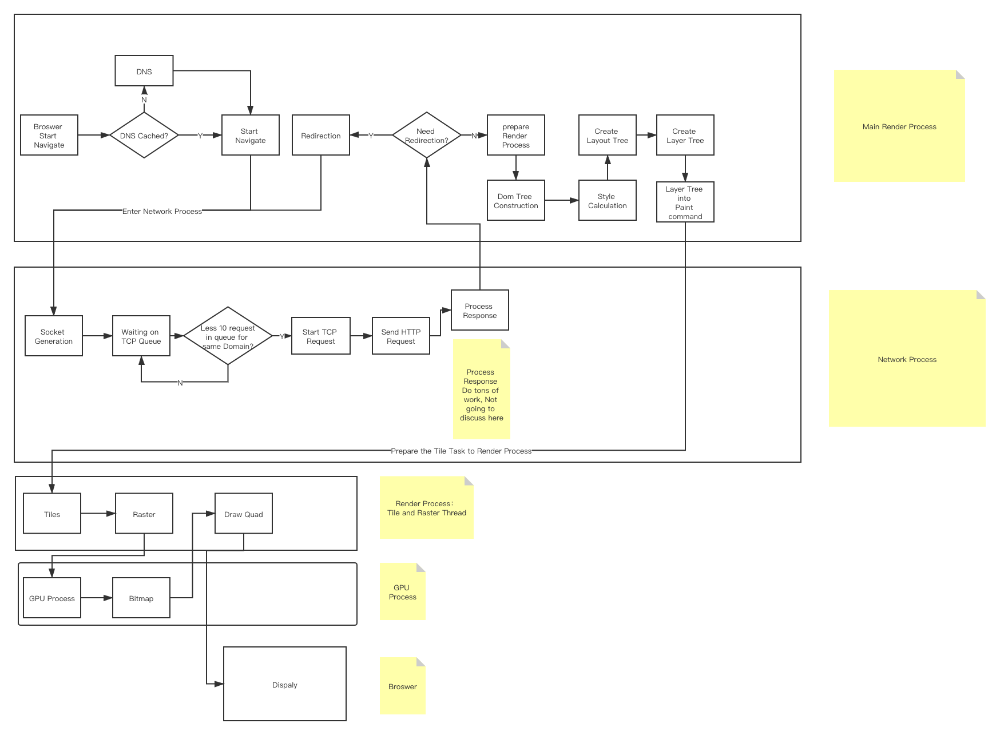

学习笔记

# Week 2 Note

## Broswer Work Flow

In Chrome:



主要分为一下几种进程:

- Broswer 主进程: 界面显示，交互，子进程管理
- GPU: 帮助渲染进程执行 Raster 任务
- Render：
  1. 工作流
     pipe(
     (HTML,JS,CSS) => DOM Tree + computed style,
     (Dom Tree + computed style, Layer Info) => Layerd Tree,
     (Layered Tree) => paint command)
  2. 沙箱模式运行
  3. 默认情况下，每一个 Tab 一个渲染进程
- Network： 网络资源加载
- Plugin

In General：
Broswer 工作流程为:
URL = GENERATE HTTP Request and Get Response for => <br/>
HTML = Parse The HTML + CSS + JS for =><br/>
DOM Tree = And use aquired CSS Compute =><br/>
DOM with CSS = Append the Layout Info =><br/>
DOM With Position = give to the Render Engine for =><br/>
Bitmap<br/>
So：
Broswer 就是一个从 URL 生成 Bitmap 的程序

Bitmap：

- A Bitmap is a mapping from some domain (for example, a range of integers) to bits.
- 简而言之 Bitmap is:

```
  Map<Domain_Element, BIT> 可能不是很恰当
```

## 有限状态机 Finite-State-Machine

是表示有限个状态以及在这些状态之间的转移和动作等行为的数学计算模型（官方解释好 DRY 啊）。

### 个人觉得就是可以表示一个状态到另外一个状态的介质 The medium use for represent the transforming process from a state to another state

术语：

1. 状态 State

- 表示系统从开始到现在的时刻的变化

2. 动作 Action

- 表示系统在给定时刻要进行的活动描述
  - 进入动作： 进入状态时进行
  - 退出动作： 退出状态时进行
  - 输入动作： 依赖于当前状态和输入条件进行
  - 转移动作：在进行特定转移时进行

分类：

1. Moore 型：

- 输出只由当前状态所决定
- 例子
  ```
  function mooreState (input) {
   if(current === S1){
     return 'Barney is Handsome'
   }
   return 'Barney is super cool'
  }
  ```

2. Mealy 型：

- 输出由当前状态和 input 共同决定
- 例子
  ```
  function mealyState (input) {
   if(input === -1){
     return 'Barney is legendary'
   }
   if(current === S1){
     return 'Barney is Handsome'
   }
   return 'Barney is super cool'
  }
  ```

#### 这不就是动规吗， 由之前的状态推到出下一个状态，可能会依赖当时的 input， 当年的 KMP 白背了

### KMP

```
  next_state[current_state][input_char] = next_state; //记录下一个state
  last_matched_prefix = last_good_state;//记录匹配失败后回滚的state

```

### HTTP

Application Layer Protocol，
Http 1/2 基于 TCP
HTTP 3 基于 QUIC（UDP）

HTTP/1.1： 默认采用持续连接（Connection: keep-alive），还有以管道方式（对头阻塞是个问题）在同时发送多个请求，以便降低线路负载，提高传输速度。

#### 格式：

```
  POST / HTTP/1.1  //请求行
  HOST:xxx.xxx.xxx //请求头*
            //分割行
  a=aaaaa //BODY

  HTTP/1.1 200 OK //响应行
  Content-Length: 3059 //头
  Connection: keep-alive
                  //分割行
  asdasdas=asdasd  //BODY
```

#### 状态码

- 1\*\* 服务器收到请求，需要继续执行操作 continue/switch protocol
- 2\*\* 成功，操作被成功接收并处理
- 3\*\* 重定向，
- 4\*\* 客户端错误，无法完成请求
- 5\*\* 服务器错误，服务器处理请求发生了错误

PS：Body 的解析是根据 content-type 头来的

#### 练习位于 toy-broswer 下
