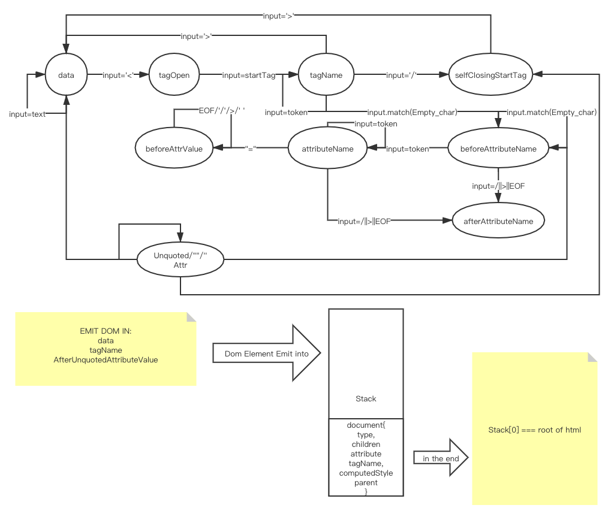

学习笔记

# Week 3 Note

## State Machine Implementation for Parse Html into Dom tree

## Html：

- 三种标签： 开始/结束/自封闭
- 空白符：\t, \n\r, space

进入 Emit 阶段后， 将维护一个 stack 来进行 DOM 树的构建， 同时预先入栈一个 Document 的节点， 为之后方便取出 DOM 树做准备。

Emit 阶段分为三种处理方式

1. StartTag：
   - 创建新的 Element {type, children,attribute}
   - 归纳所有的 Attribute {name,value}
   - 计算 CSS Rules
   - 将新加的 element 插入到父节点的 Children 中
   - 如果不是 selfClosing 的元素，则入栈等待匹配
2. EndTag：
   - 如果是 Style 元素，则收集 content 作为 Css Rule（由于是 toy broswer 不考虑 body 遇见 Style tag 的情况，）
   - 然后 pop stack，生成 Element
3. Text
   - 如果 CurrentTextNode 没有生成，则生成 TextNode
   - 将所有的 Text 归纳到 CurrentTextNode 中

## CSS：

1. 规则收集
   - Toy Broswer 使用 css node module 每当遇见 endTag 为 style 的时候进行规则收集。生成 AST。
2. 获取父元素
   - CSS selector 大多都会和父元素强关联， 譬如 div > p, div > .aaaa， 只有在获取父元素的情况下才能确定 selector 是否匹配
3. 选择器与元素匹配
   - 根据 selector.charAt(0)来区分 id selector， class selector， 以及 tagName
4. 生成 computed 属性
   - 一旦选择器与元素匹配上， 就直接将 computedStyle 抄到元素上
5. specificity
   - 特异性， 用于表示 CSS rule 作用于元素上的优先级， 优先级以四目的方式计算
   - Inline Selector > ID Selector > Class Selector > TagName Selector
   - 数据表示： 【 inline， id， class， tagName 】
   - 比较方式： 从左往右,越往左优先级越高
